# Salary Prediction Web Application


A full-stack machine learning web application for salary prediction. The system combines a React frontend, FastAPI backend, PostgreSQL persistence, model training/inference pipelines, Docker-based local development, and Google Cloud deployment workflows.

The application supports interactive salary prediction, storing user-added salary records, and retraining the model without blocking the API service.

<p align="center">
    <a href="docs/demo.mp4">
        
    </a>
</p>

> **Deployment note:** the previous public GCP deployment is currently offline to control cloud costs. The project remains reproducible locally with Docker Compose.

---

## Contents

- [Features](#features)
- [Architecture](#architecture)
- [Machine Learning Pipeline](#machine-learning-pipeline)
- [Model Metadata](#model-metadata)
- [Tech Stack](#tech-stack)
- [Project Structure](#project-structure)
- [Local Development](#local-development)
- [Usage](#usage)
- [Testing](#testing)
- [CI/CD](#cicd)
- [Future work](#future-work)
- [License](#license)

---

## Features

### Application

- Interactive salary prediction UI built with React and Vite.
- Responsive desktop and mobile layouts.
- Distribution visualizations for prediction context.
- User flow for adding new salary records.
- User-triggered retraining workflow after data changes.

### Backend

- FastAPI REST API with OpenAPI documentation.
- Service-layer structure for data access, prediction, and model lifecycle operations.
- PostgreSQL persistence through SQLAlchemy.
- Separate inference and training responsibilities.

### Machine Learning

- Data cleaning and feature engineering pipeline.
- Train/test split workflow.
- Candidate model comparison through cross validation.
- Hyperparameter tuning with Optuna.
- Model artifact and metadata persistence.

### Infrastructure

- Docker Compose setup for local development.
- GitHub Actions workflows for backend and frontend checks.
- GCP Cloud Run service for backend deployment.
- GCP Cloud Run Job pattern for retraining workloads.
- Cloud Storage support for persisted model artifacts.

---

## Architecture

```text
Browser / Mobile Client
        |
        v
React Frontend
        |
        v
FastAPI Backend
        |
        +--> PredictionService --> Loaded model artifact
        |
        +--> DataService -------> PostgreSQL / Cloud SQL
        |
        +--> ModelService ------> Training job trigger
                                  |
                                  v
                          Model artifacts / metadata
```

For cloud deployment, the backend is designed to run as a Cloud Run service, while retraining can run as a Cloud Run Job. This keeps inference APIs responsive while training executes in a separate worker-style environment.

---

## Machine Learning Pipeline

```text
Raw salary data
    |
    v
Data cleaning and feature engineering
    |
    v
Train/test split
    |
    v
Candidate model comparison
    |
    v
Optuna hyperparameter tuning
    |
    v
Final model training
    |
    v
Evaluation: MSE, MAE, RMSE, R²
    |
    v
Persist model artifact and metadata
```

The pipeline is implemented under `apps/backend/src/app/ml/` and includes modules for data cleaning, feature transformation, model construction, model comparison, tuning, training, and artifact saving.

---

## Model Metadata

The latest committed model metadata is available at:

```text
apps/backend/artifacts/metadata.json
```

Current metadata snapshot:

| Metric | Value |
|---|---:|
| Best model | XGBoost (`xgb`) |
| R² | 0.899 |
| MAE | 11,291 |
| RMSE | 16,611 |
| Train rows | 1,426 |
| Test rows | 357 |
| Total rows | 1,783 |
| Training duration | 86.51 s |

The training code records these values in `apps/backend/src/app/ml/train/trainer.py` after evaluation on the test split.

---

## Tech Stack

| Layer | Tools |
|---|---|
| Frontend | React, Vite, Axios, Bootstrap, Vitest, React Testing Library |
| Backend | Python, FastAPI, Uvicorn, Pydantic Settings |
| Database | PostgreSQL, SQLAlchemy |
| ML | scikit-learn, XGBoost, TensorFlow, Optuna, Pandas, NumPy |
| Visualization | Matplotlib, Seaborn |
| Local development | Docker, Docker Compose, uv, npm |
| CI/CD | GitHub Actions |
| Cloud | GCP Cloud Run, Cloud Run Jobs, Cloud SQL, Cloud Storage |

---

## Project Structure

```text
.
├── apps/
│   ├── backend/              # FastAPI service, ML pipeline, tests, artifacts
│   └── frontend/             # React/Vite UI, API client, component tests
├── docs/                     # Demo media, screenshots, test evidence, project notes
├── infra/
│   ├── local/                # Docker Compose configuration
│   └── gcp/                  # Cloud Run service/job YAML manifests
├── setup                     # Helper script for environment and Docker workflow
├── .env.example              # Example local configuration
├── .github/workflows/        # Backend and frontend CI/CD workflows
├── LICENSE
└── README.md
```

---

## Local Development

### Prerequisites

- Docker 29+
- Node.js 25+ and npm 11+ if running the frontend outside Docker
- Python 3.12+ and `uv` if running the backend outside Docker

### Run with Docker Compose

```bash
git clone https://github.com/StevenHuang41/salary_prediction_web_application.git
cd salary_prediction_web_application

# Create .env from .env.example
./setup env

# Build and run the local stack with a fresh database volume
./setup -dbv
```

Open:

- Frontend: <http://localhost:3000>
- Backend OpenAPI docs: <http://localhost:8080/docs>

### Setup helper commands

```bash
./setup help       # Show available commands
./setup env        # Create .env from .env.example
./setup -b         # Build and run containers
./setup -d         # Stop containers
./setup -dv        # Stop containers and remove the database volume
./setup -dbv       # Rebuild with a fresh database volume
```

---

## Usage

### Prediction flow

1. Fill out the salary prediction form.
2. Submit the prediction request.
3. Review the predicted salary and distribution visualizations.
4. Optionally adjust values and add a new record.
5. Trigger retraining so the model can incorporate newly added data.

### UI previews

Frontend:

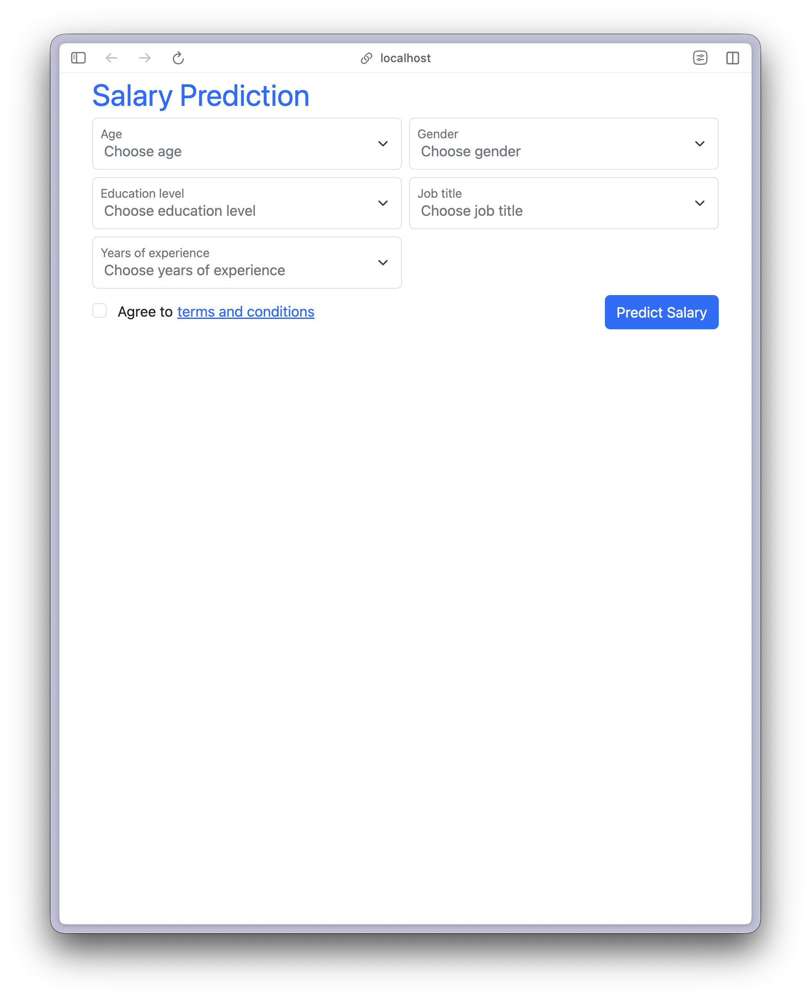

Backend OpenAPI docs:

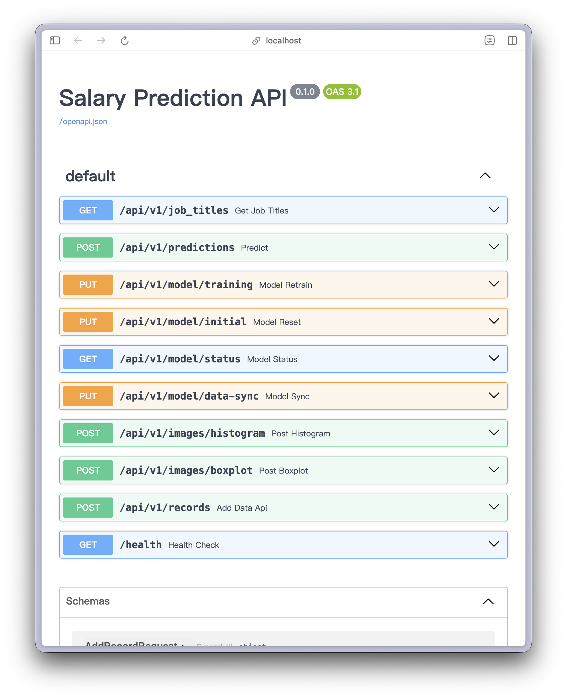

Mobile:

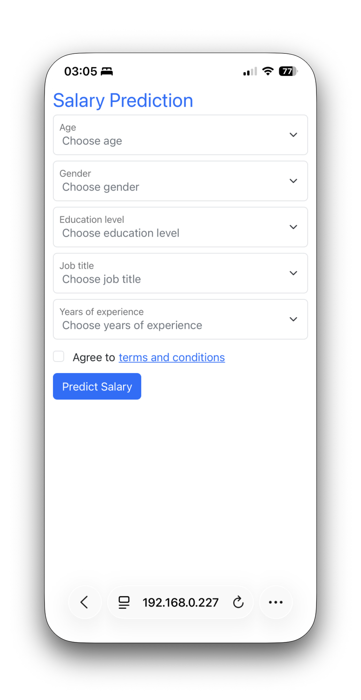

### Interaction examples

Fill out the form and predict:

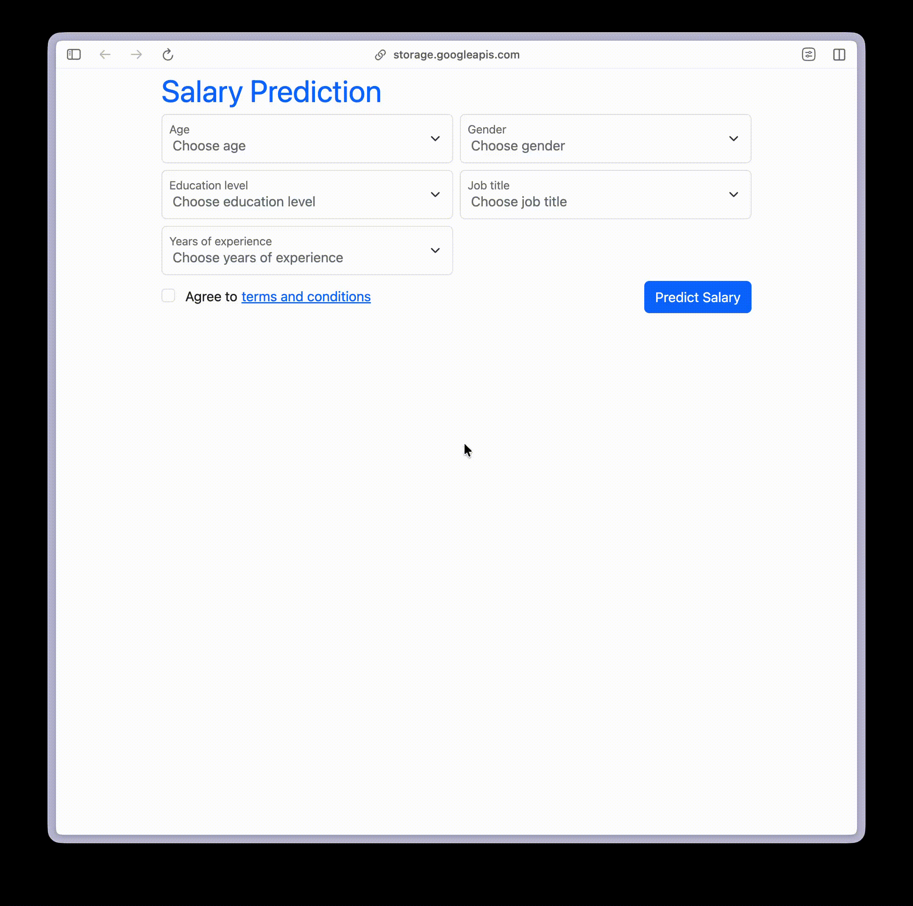

Open advanced options:

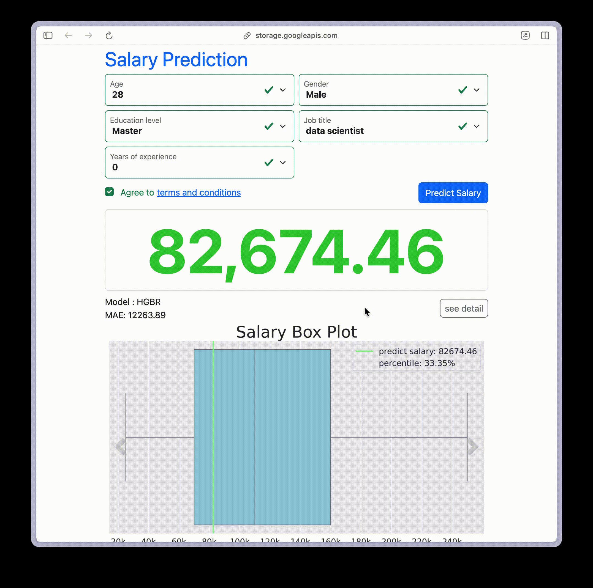

Change prediction inputs with keyboard or slider:

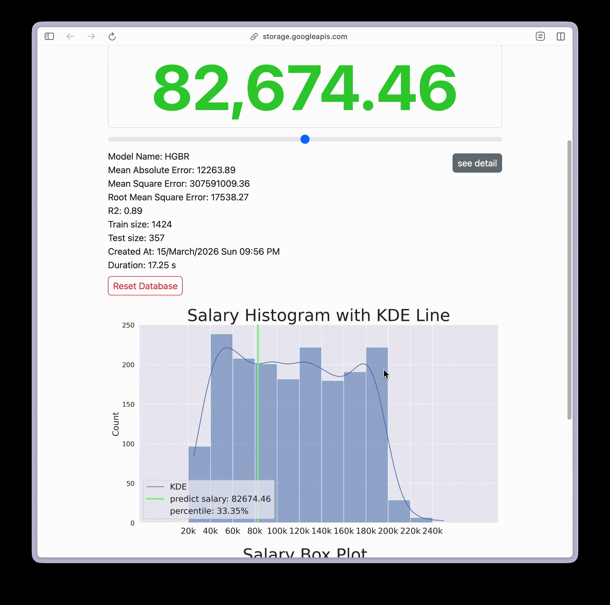

Add a new record:

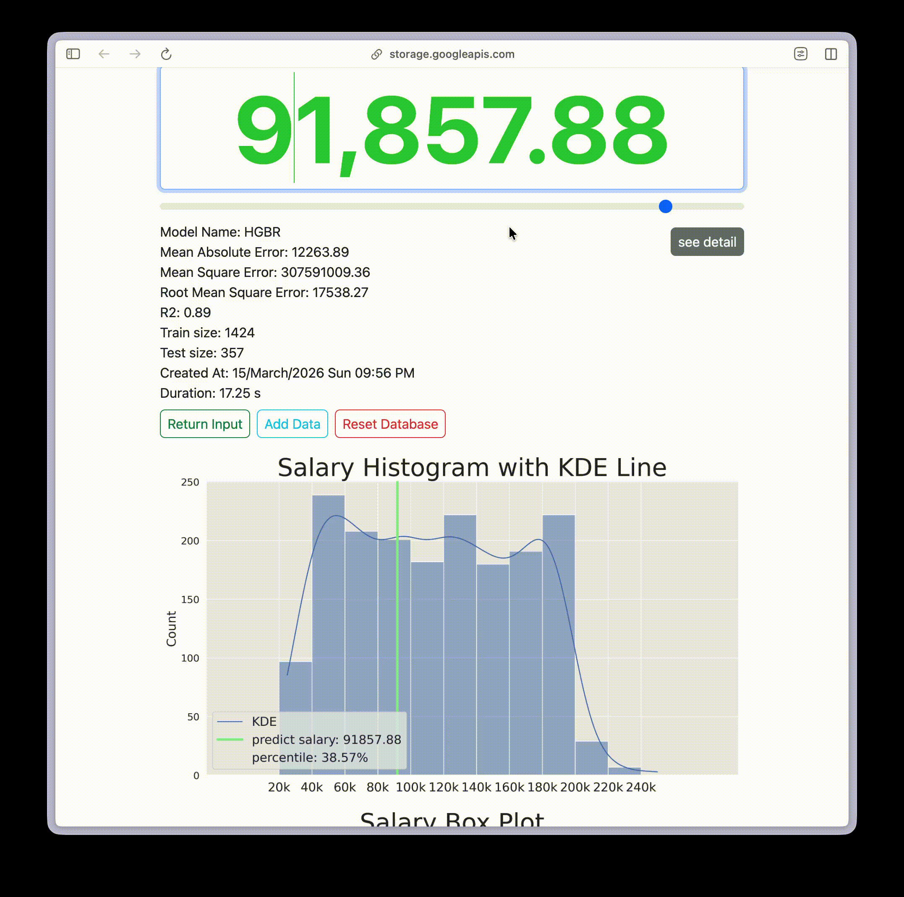

Retrain the model:

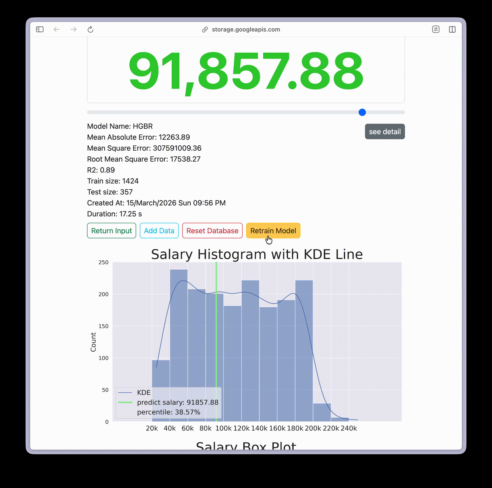

Reset database and retrain:

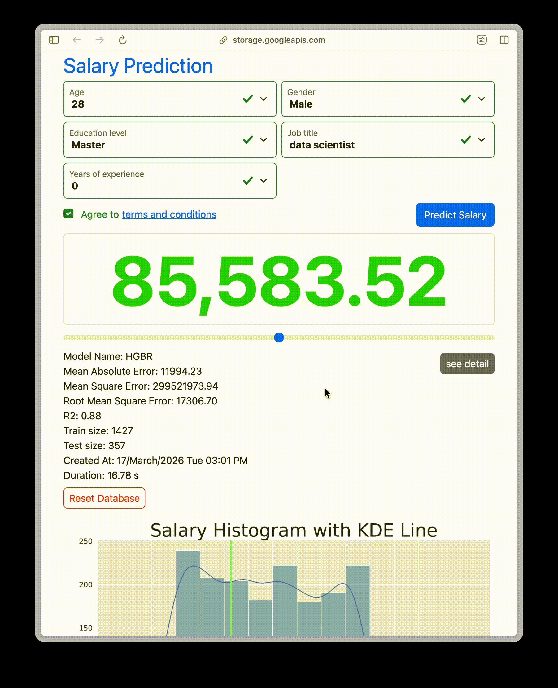

---

## Testing

### Backend

```bash
cd apps/backend
uv sync --frozen
uv run pytest
```

Evidence:

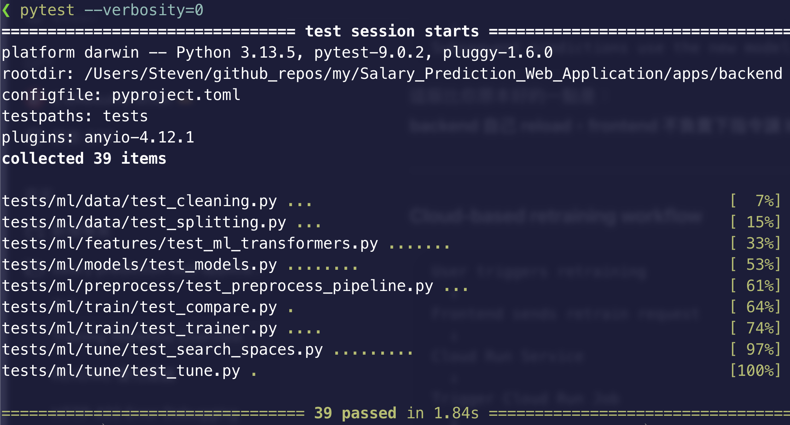

### Frontend

```bash
cd apps/frontend
npm ci
npm run test -- --run
```

Evidence:

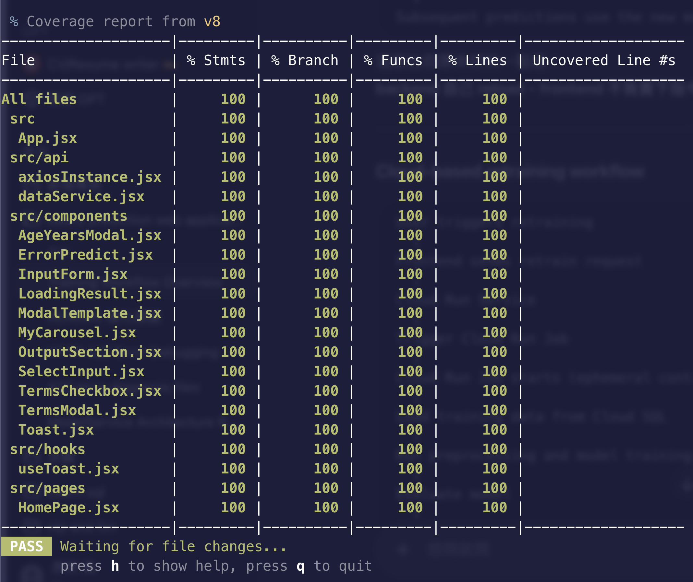

---

## CI/CD

| Workflow | Purpose |
|---|---|
| `.github/workflows/backend.yml` | Run backend tests, build the backend Docker image, deploy the Cloud Run service/job |
| `.github/workflows/frontend.yml` | Run frontend tests, build the React app, upload static assets to Cloud Storage |

The backend deployment uses YAML manifests under `infra/gcp/` so cloud runtime configuration is versioned with the application code.

---

## Future Work

- Allow input of job title by keyboard (accept unknown jobs).
- Add an AI assistant chatbox for user interaction

---

## License

This project is licensed under the [MIT License](./LICENSE).

---

## Credits

Thanks to all contributors.

[](https://github.com/StevenHuang41)
[](https://github.com/evelynhuang22)

See the [contributors list](https://github.com/StevenHuang41/salary_prediction_web_application/graphs/contributors).
