# 📈 Salary Prediction Web Application

A full-stack machine learning application that predicts real-time salary predictions through a production-ready pipeline.
This project includes automated data preprocessing, feature engineering, hyperparameter optimization, model retraining, and interactive UI –– all containerized for scalable deployment.

[](./LICENSE)

## 🔎 Overview

- [Features](#-features)
- [Tech Stack](#-tech-stack)
- [Project Structure](#-project-structure)
- [Installation & Setup](#️-installation--setup)
    - [Manual](#1-️-manual)
    - [Docker](#2--docker)
- [Usage](#-usage)
    - [Local machine](#️-local-machine-access)
    - [Mobile](#-mobile)
    - [App Instructions](#-app-instructions)
- [Contributing](#-contributing)
- [License](#-license)
- [Credits](#-credits)

## ✨ Features

- **End-to-End Machine Learning System**
    - Automated data preprocessing (cleaning, enocding, feature engineering)
    - Dynamic feature generation and model retraining
    
- **Advanced Model Optimization**
    - Bayesian optimization (BayesSearchCV)
    - Multiple ML backends (scikit-learn, Keras/TensorFlow)

- **Interactive Web Application**
    - Responsive UI built with React + Bootstrap
    - Editable predictions
    - User-driven retraining workflow
    - Interactive visualizations with matplotlib & seaborn
    
- **Data infrastructure**
    - SQLite-based persistent storage
    - Auto-update training/test splits
    - Incremental data ingestion

- **Containerized Development**
    - Dockerized frontend & backend
    - One-command setup view ./setup
    - Works on local machine or LAN network (mobile supported)

## 🛠 Tech Stack

| Layer | Tools |
| :---: | :--- |
| **Frontend:** | React / Vite / Vitest / Bootstrap|
| **Backend:** | Python / FastAPI / Uvicorn |
| **Database:** | SQLite3 / Pandas |
| **ML / Optimization:** | scikit-learn / Tensorflow / Keras Tuner / BayesSearchCV |
| **DevOps:** | Docker / Git / Bash / uv|

## 📁 Project Structure

### root

```sh
.
├── README.md
├── docker-compose.yml
├── setup               # utility setup script
├── frontend/           # React application
├── backend/            # FastAPI server + ML pipeline
├── readme_images/
└── .gitignore
```

### Frontend

```sh
frontend/
├── README.md
├── Dockerfile
├── package.json
├── package-lock.json
├── vite.config.js
├── eslint.config.js
├── index.html
├── src/
├── public/
├── .gitignore
└── .dockerignore
```

### Backend

```sh
backend/
├── README.md
├── Dockerfile
├── main.py
├── uv.lock
├── pyproject.toml
├── requirements.txt
├── my_package/
├── database/
├── .gitignore
└── .dockerignore
```

## ⚙️ Installation & Setup

### • 🧩 Prerequisites

- **Python:** >=3.10

- **Node.js:** >=20.9.0

- **npm:** >=10.0.0

- (Optional) **[uv](https://github.com/astral-sh/uv/)** (for faster python packages installation)

- (Optional) **[Docker](https://www.docker.com/)** (for containerized setup)

Check version with:
```sh
[tool] --version
```
Replace `[tool]` with `python`, `node`, `npm`, etc.

### • 🔐 Clone the repo:

```sh
# SSH:
git clone git@github.com:StevenHuang41/salary_prediction_web_application.git

# or HTTPS:
git clone https://github.com/StevenHuang41/salary_prediction_web_application.git

cd salary_prediction
```

---

### • 🧱 Installation & Setup Methods:

- [Manual Installation](#1-️-manual)

- [Docker Installation & Setup](#2--docker) (Recommended)

---

### 1. 🕹️ Manual

- #### Frontend
    ```sh
    cd frontend
    npm install
    ```  

- #### Backend
    ```sh
    cd backend
    pip install -r requirements.txt
    # or using uv
    uv sync --locked 
    ```

- #### Setup

    use `setup` to get __local IP address__ and create `.env.local` files
    ```sh
    ./setup
    ```
    **Expected result:**
    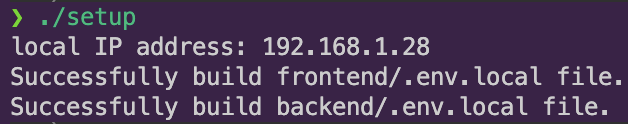

- #### Start Servers

    open 4 terminals, and run each command respectively.

    - **Frontend test**

        ```sh
        cd frontend
        npm test
        ```

        **Expected result:**
        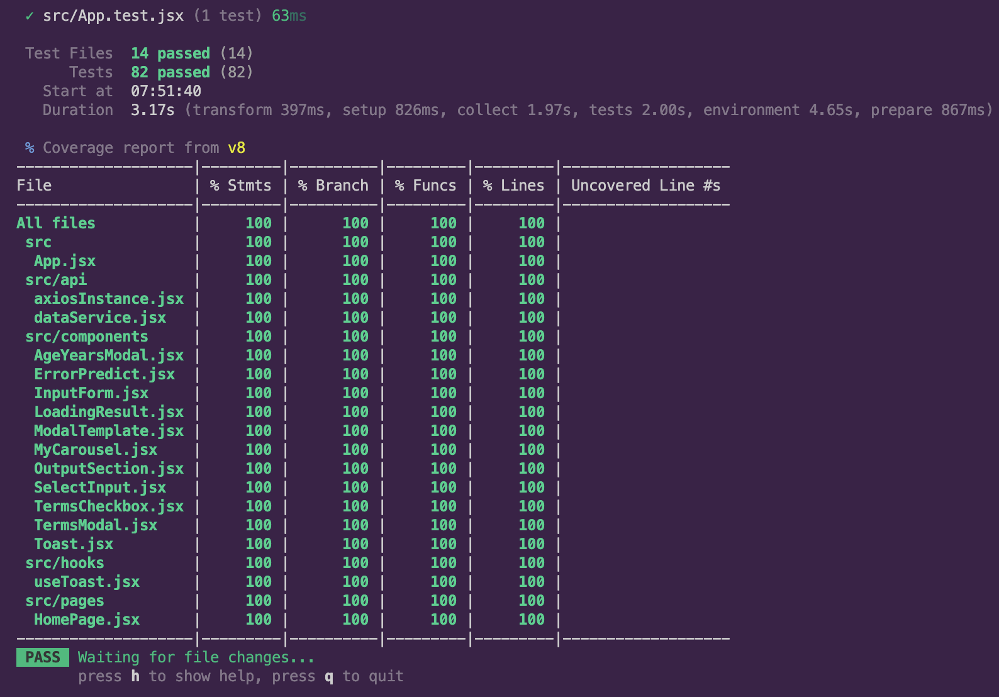

    ---

    - **Frontend server**

        ```sh
        cd frontend
        npm run dev
        ```

        expected result:
        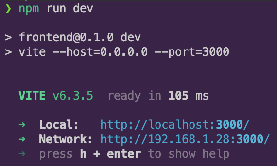

    ---

    - **Backend server**

        for basic api request

        ```sh
        cd backend
        python main.py 8001

        # or use uv to run
        uv run main.py 8001
        ```

        expected result:
        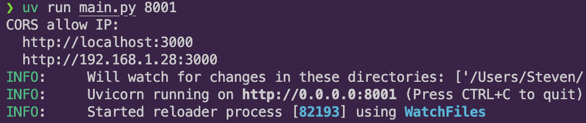

    ---

    - **Backend training server**

        ```sh
        cd backend
        python main.py 8000

        # or use uv to run
        uv run main.py 8000
        ```
        expected result:
        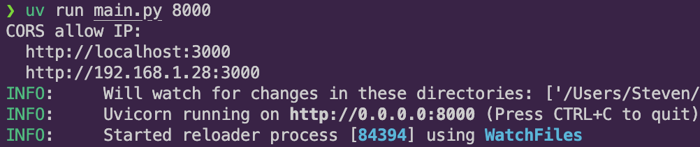

---

### 2. 🐳 Docker Setup (Recommended)

```sh
./setup build
```
see `./setup --help` for further setup shell script imformations  

This performs:

✅ `.env.local` generation <br>
✅ `docker compose up --build` <br>
✅ Fully automated environment setup


**Expected result:**
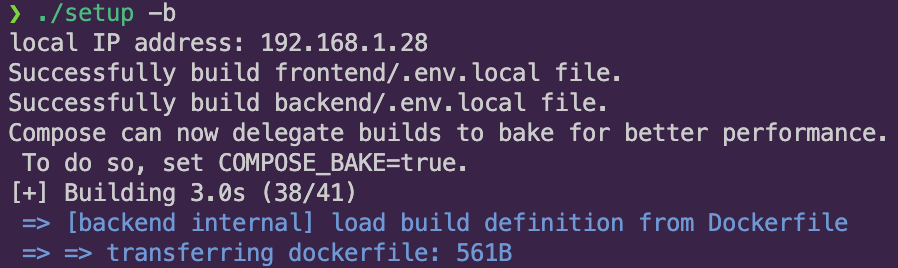


## 🚀 Usage

### 🖥️ Local Machine

- **Frontend:** <http://localhost:3000>
- **Backend:** <http://localhost:8001/docs>
- **Training:** <http://localhost:8000/docs>

**UI preview:**

- frontend:
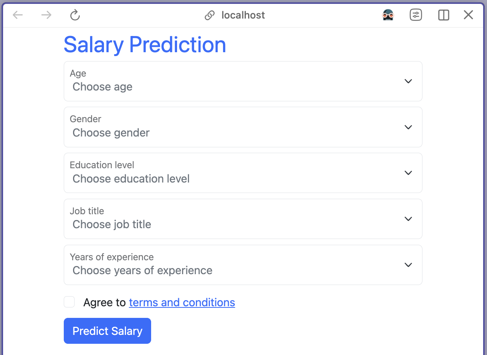

- backend:
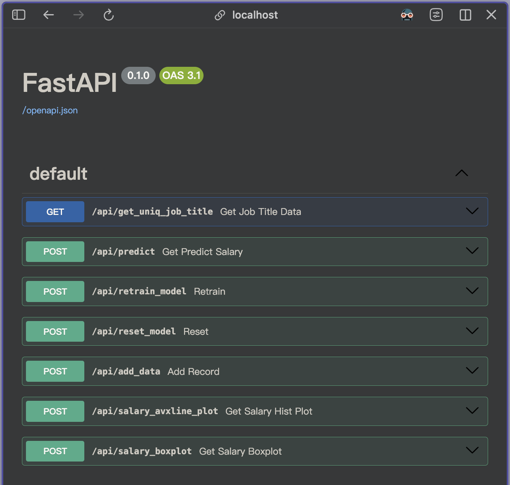

---

### 📱 Mobile

- Enter `http://[local IP address]:3000/` in your mobile browser
    Replace `[local IP address]` with your local machine [IP address](#setup)

**UI preview:**
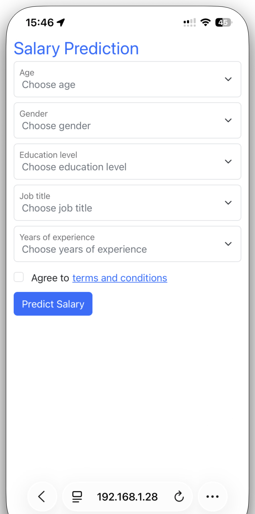


### 📝 App Instructions

- Fill out the form -> click **Predict Salary** button


- Click **see detail** button for extended options
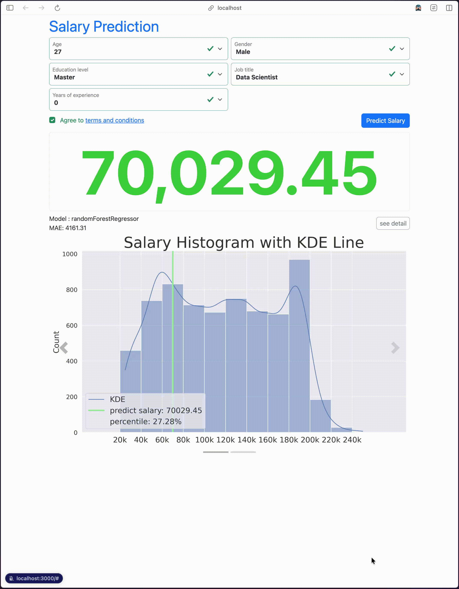

- Change predict value using keyborad or slider
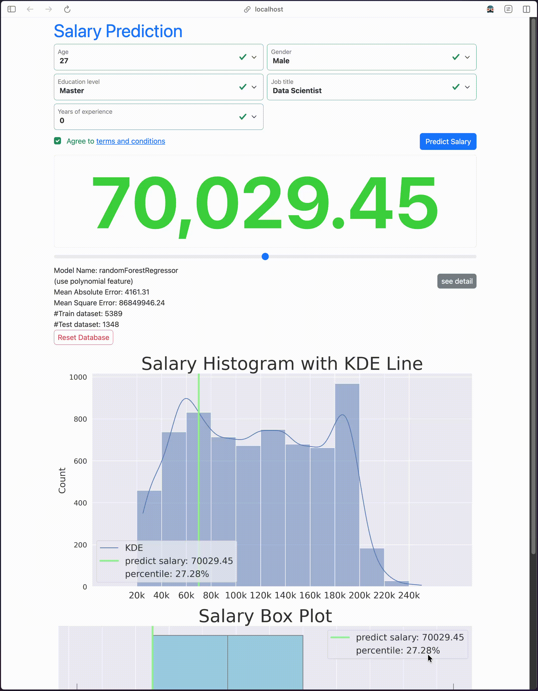

- Click **Add Data** button to store changed prediction
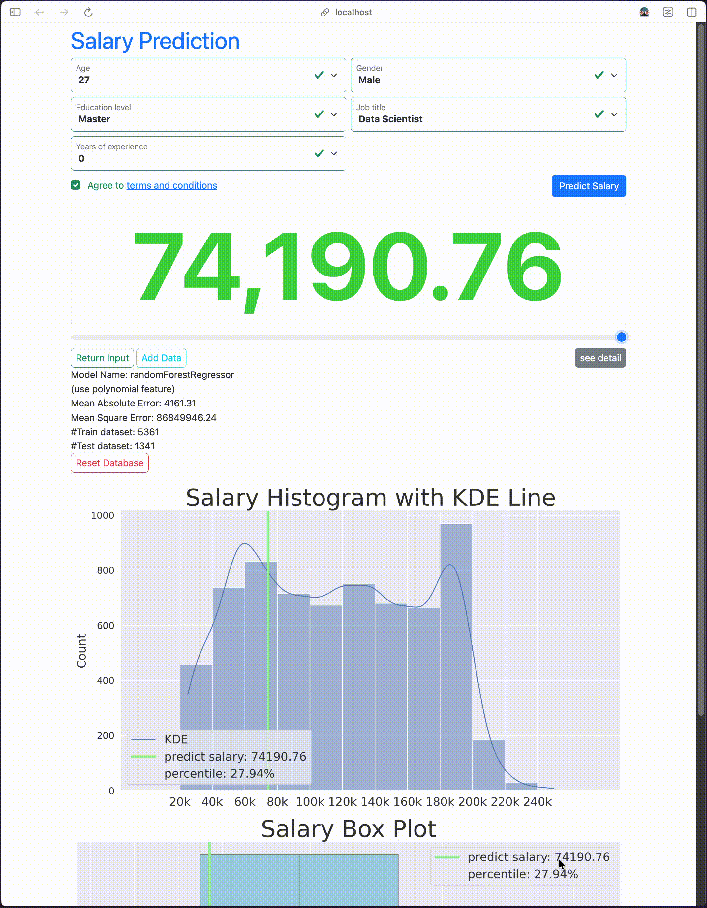

- Click **Retrain Model** button to train on new records
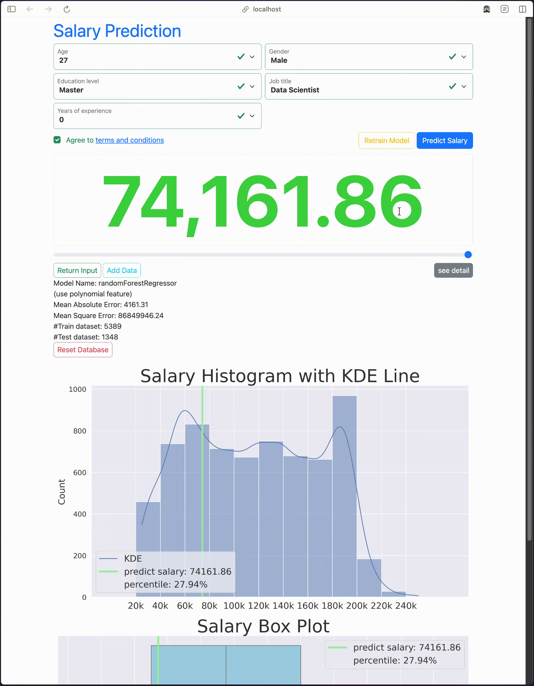

- After retraining, prediction value changes, and the number of records in Train and Test dataset change
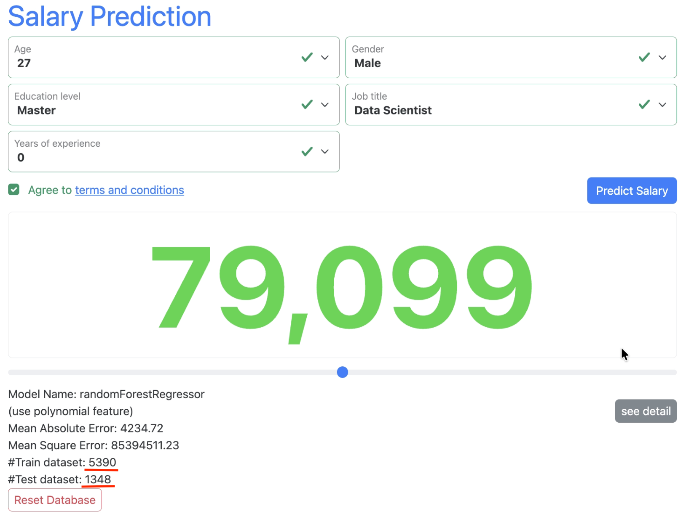

- Click **Reset Database** button to clear added data in database, and click
**Retrain Model** button again to retrain model with original data.
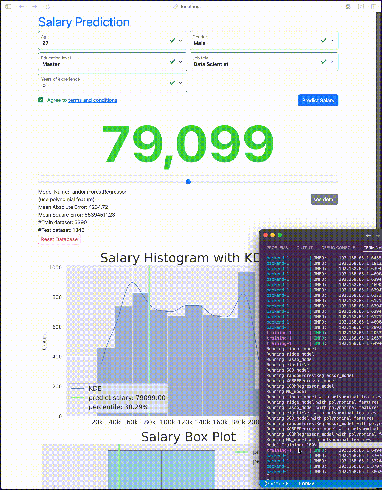

## 📋 TODO

- Allow input of job title by keyborad (accept unknown jobs).
- A chatbot for user asking questions.

## 🛠 Development Workflow
- Git-based feature branches
- Dockerized reproducible environments
- ML pipeline modularized in `my_package`
- Auto-retraining compatible with both scikit-learn and TensorFlow pipelines

## 🤝 Contributing

1. Fork
2. Clone
3. Create a new branch
   ```sh
   git switch -c feature-branch
   ```
4. Commit changes
   ```sh
   git commit -m "Add some feature"
   ```
5. Push
   ```sh
   git push origin feature-branch
   ```
6. Create a Pull Request.

## 📄 License

This project is licensed under the [MIT License](./LICENSE).

## 👏 Credits

Thanks to all contributors!

[](https://github.com/StevenHuang41)  [](https://github.com/evelynhuang22)


See the [contributors list](https://github.com/StevenHuang41/salary_prediction/graphs/contributors)
